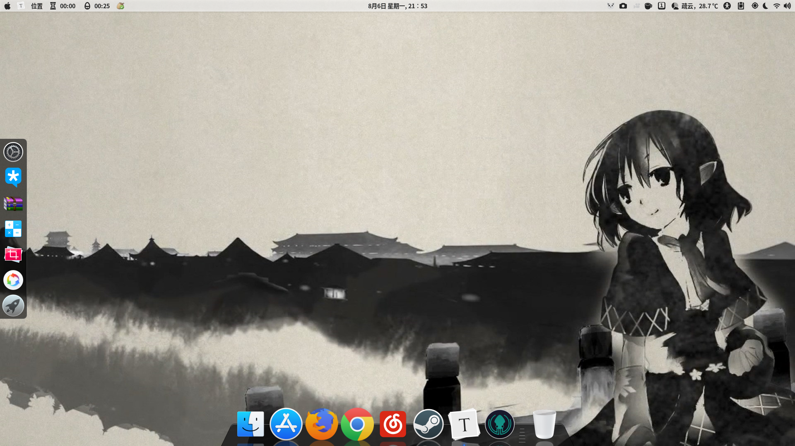
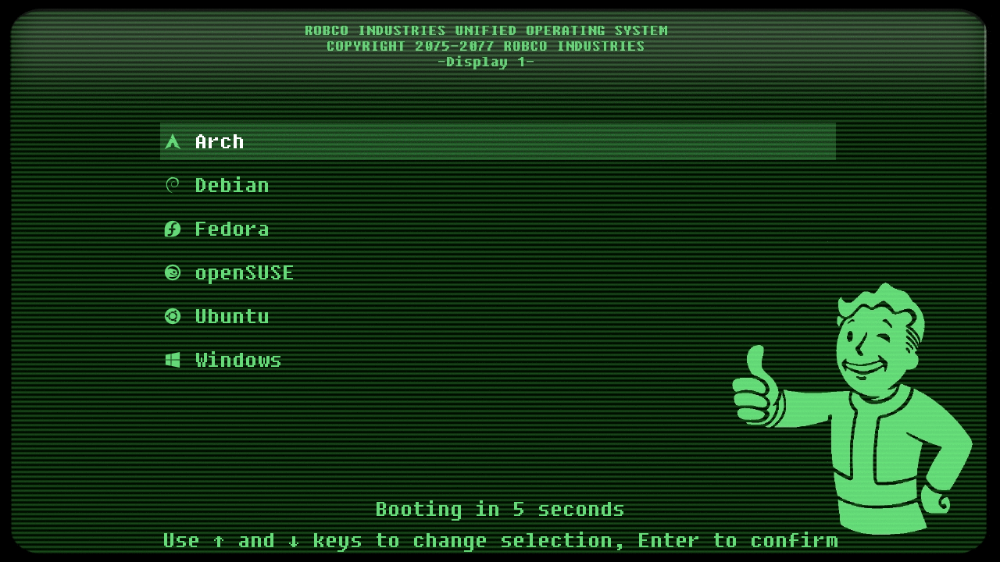
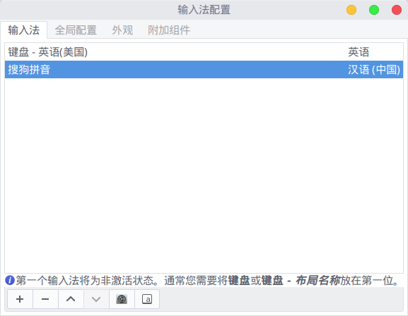
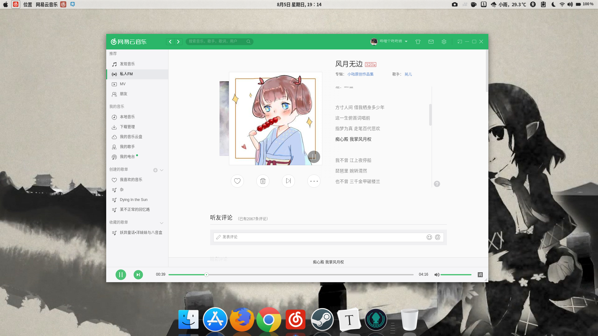
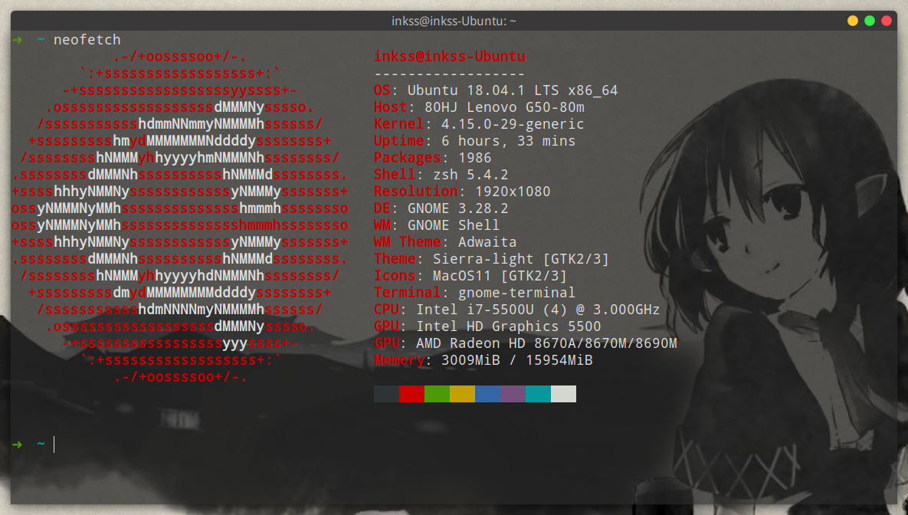
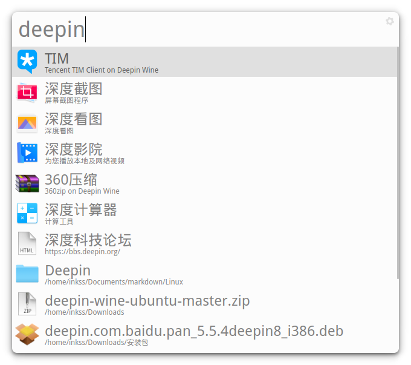

# Ubuntu 18.04 安装、配置和美化

- 概述：UEFI 引导下的 Win10 与 Ubuntu 双系统安装记录。
- 前置：在 Windows 系统上通过压缩卷给 Ubuntu 划分空间安装之。
- 简介：曾经记录过一篇安装 Ubuntu 18.04 的注意事项文章，但是所有过程都是在虚拟机下进行的，本次则使用双系统的方式对系统进行安装。内容上包括：系统的安装、配置、美化和一些软件的安装介绍。
- 地址：[本文章](https://github.com/inkss/markdown/blob/master/Linux/Ubuntu/Ubuntu-18.04-%E5%AE%89%E8%A3%85%E8%AE%B0%E5%BD%95.md)原文件存放在 GitHub 的 [markdown](https://github.com/inkss/markdown) 仓库中（推荐下载后使用 [Typora](https://typora.io/) 阅读）。

------

## 目录

* [一、安装操作系统](#一-安装操作系统)
  * [（1）引导盘](#1-引导盘)
  * [（2）分区](#2-分区)
  * [（3）安装系统](#3-安装系统)
* [二、初步系统配置](#二-初步系统配置)
  * [（1）不可或缺的更新](#1-不可或缺的更新)
  * [（2）双系统的时区问题](#2-双系统的时区问题)
  * [（3）更换终端类型](#3-更换终端类型)
* [三、配置与美化系统](#三-配置与美化系统)
  * [（1）Gnome-tweak-tool](#1-gnome-tweak-tool)
  * [（2）主题 图标 字体](#2-主题-图标-字体)
  * [（3）Grub 启动项美化](#3-grub-启动项美化)
  * [（4）搜狗输入法](#4-搜狗输入法)
  * [（5）底栏 Docky](#5-底栏-docky)
* [四、软件安装与记录](#四-软件安装与记录)
  * [（1）Deepin-Wine 环境：QQ、百度网盘、微信等 ](#1-deepinwine-环境)
  * [（2）网易云音乐（解决无法打开软件的问题）](#2-网易云音乐)
  * [（3）一般性软件安装（谷歌、SS、Typora 等）](#3-一般性软件安装)
  * [（4）Ubuntu 18.04 Gnome 必备扩展](#4-gnome-扩展)
  * [（5）使用 Snap 包安装软件（含介绍）](#5-使用-snap-包安装软件)

------

## 一 安装操作系统

### 1 引导盘

鉴于现在都 18 年了，是时候抛弃 Legacy 引导，完全采用 UEFI 引导了。

而这里有两种选择（所有操作均在 Windows 下进行）：

- 刻录到光盘：

  使用 *[UltraISO](https://www.ultraiso.com/download.html)* 进行刻录，在完成之后，电脑可以对光盘识别到 Legacy 和 UEFI 两种方式的引导项。而如果 BIOS 中设置为仅 UEFI ，就只需直接选择进行安装即可。

- 刻录到 U 盘：

  Ubuntu 官网中推荐的 U 盘刻录工具为 *[Universal-USB-Installer](https://www.pendrivelinux.com/universal-usb-installer-easy-as-1-2-3/)* ，但是需要注意的是这个工具刻录后的 U 盘只有 Legacy 引导 ，所以只能抛弃该软件。然后在网上简单的搜索后找到了另一款 U 盘刻录工具：*[Rufus](https://rufus.akeo.ie/?locale=zh_CN)*，提到了其具有**免安装、绿色版、支持 UEFI 引导**的特点，那么就选用它了。

> 刻录过程不多赘述，Rufus 刻录时分区类型选择 `GPT`。

### 2 分区

本次目标是做一个双系统出来，所以保留原 Windows 系统，压缩出一个分区给 Ubuntu 使用。

打开 Windows 的文件管理器（快捷键 Win + E），展开顶部选择**计算机**→**管理**。

然后选择**磁盘管理工具**，对相应分区进行压缩。

> 具体的压缩教程可搜索查询，需要注意一下对压缩后的新分区**不要新建简单卷或格式化**。

### 3 安装系统

正常的安装过程，诸如对 BIOS 进行设置之类，网上教程很多，这里不多赘述。

> 在到 *安装类型* 这一步时，如果你在上一步压缩完分区后，没有新建简单卷，那么就会多出一个**安装 Ubuntu，与 Windows boot manager 共存**这一选项，那么就只需默认无脑下一步即可。
>
> 而如果需要自主划分分区，就选择 *其他选项 。*分区只推荐划分出根 `/` 和家目录 `/home`。
>
> 注意1：为了系统的稳定，安装过程中请连上网络，勾选**安装 Ubuntu 时下载更新**。
>
> 注意2：安装时选择**最小安装**，除非你对雷鸟、LibreOffice  之类的软件感兴趣。

## 二 初步系统配置

### 1 不可或缺的更新

如果在上一步中勾选了安装 Ubuntu 时下载更新，那么大部分的更新已经下载完毕。

不过为了确保，先移步到**设置**→**详细信息**，点击右下角的**检查更新**，如果存在更新，那么完成相应的更新操作。

接着移步到**设置**→**区域和语言**→**管理已安装的语言**，在此处完成一个更新下载。

最后，为了确保全部内容都更新完毕，打开终端使用命令安装更新：

```sh
sudo apt update
sudo apt upgrade
```

也可以不使用命令行，使用 *软件更新器* 对系统和软件进行更新。

### 2 双系统的时区问题

双系统下 WIndows 与 Ubuntu 的时间将会不相同，原因不多阐述，解决方案如下：

```sh
timedatectl set-local-rtc 1
```

### 3 更换终端类型

这里推荐使用 **oh-my-zsh** ，因为其具有十分方便的 *Tab* 补全能力：

```sh
sudo apt-get install git
sudo apt-get install zsh
wget https://github.com/robbyrussell/oh-my-zsh/raw/master/tools/install.sh -O - | sh
chsh -s /usr/bin/zsh
```

> 重启系统以生效。

## 三 配置与美化系统



### 1 Gnome-tweak-tool

Ubuntu 18.04 与 16.04 最大的变动就是抛弃了 Unity 桌面，使用 Gnome ，所以先安装以下工具：

```sh
sudo apt install gnome-tweak-tool
```

然后移步到 **Ubuntu 软件**→**附加组件**，在此处安装相应的 Shell 组件。

为了自定义 Shell 主题，需要搜索安装插件：*User Themes（如此才可以修改 shell 样式，也就是顶栏）*

附录：一个下载主题的网站：[Gnome-look](https://www.gnome-look.org/) 


> 上图中主题和图标的的下载地址：[OSX-Arc](https://www.gnome-look.org/p/1167049/)、[MacOS Icon](https://www.gnome-look.org/p/1102582/)

### 2 主题 图标 字体

下载的主题如果是 deb 包的形式，安装方式见下文。而如果是压缩包的形式，那么就只能解压它放到对应的目录中了，这个目录有两种，区别上类似于 Windows 环境变量里的个人和系统。

- 主题存放目录：`/usr/share/themes` 或 `~/.themes`
- 图标存放目录：`/usr/share/icons` 或 `~/.icons`
- 字体存放目录：`/usr/share/fonts` 或 `~/.fonts`

*usr/share* 目录需要 root 权限才能修改，秉着有图形界面就不用终端的心态：

```sh
# 终端下打开一个具有管理员权限的文件管理器
# 打开后终端最小化，不要关闭
sudo nautilus

# 或者将相关文件放在本地目录中
```

附录一个在 Linux 下特别好用的字体：*文泉驿系列字体*

```sh
sudo apt install fonts-wqy-microhei fonts-wqy-zenhei
```

### 3 Grub 启动项美化

首先下载主题包：[Gnome Look - GRUB Themes](https://www.gnome-look.org/browse/cat/109/order/latest) （自行挑选喜欢的）

这里使用的主题包为：[Fallout ](https://www.gnome-look.org/p/1230882/)



接下来介绍安装步骤：

首先下载主题包，为 zip 压缩吧，解压出目录，使用 `sudo nautilus` 打开带权限的文件管理器。

定位到目录：`boot/grub` ，在该目录下新建文件夹：`themes` ，把解压出的目录拷贝到文件夹中。

接着终端下调用 geidt 修改 *grub* 文件：

```sh
sudo gedit /etc/default/grub
```

在该文件末尾添加：

```sh
#GRUB_THEME="/boot/grub/themes/主题包文件夹名称/theme.txt"
GRUB_THEME="/boot/grub/themes/fallout-grub-theme-master/theme.txt"
```

最后更新配置文件：

```su
sudo update-grub
```

> 重启系统以见证效果。另外谈到 grub 就不得不谈到 `/boot/grub/grub.cfg` ，这个文件才是事实上的配置文件，操纵此文件一个不慎就整个系统进不去。所谓更新配置文件就是重新生成 *grub.cfg* 的过程。

### 4 搜狗输入法

Ubuntu 18.04 没有提供 Fcitx 输入框架，所以先安装该框架：

```sh
sudo apt install fcitx
```

接着到[搜狗输入法官网](https://pinyin.sogou.com/linux/?r=pinyin)下载输入法安装包，将会下载到一个 deb 格式的安装包，安装它：

```sh
# 首先移步到文件管理器的下载目录，终端下输入以下命令进行安装
sudo dpkg -i sogoupinyin_2.2.0.0108_amd64.deb

# 一般情况下会提示安装失败，缺失依赖，所以先解决依赖问题
sudo apt install -f

# 接着重复第一步安装搜狗输入法的命令
# 一般 deb 包都是如此安装的，如果失败就去解决依赖问题
```

然后移步到**设置**→**区域和语言**，删除一部分输入源，只保留 *汉语*  。接着选择**管理已安装的语言**，修改 *键盘输入法系统* 为 **fcitx** ，关闭窗口，打开所有程序，选择软件  **Fctix 配置**，选择加号添加搜狗输入法（见下图）：



> 如果没有找到搜狗，就重启系统，再次重复以上步骤即可。
>
> 推荐一个搜狗输入法皮肤：[简约-信](https://pinyin.sogou.com/skins/detail/view/info/519557?rf=subject_jjzq&tf=p) 
>
> 

### 5 底栏 Docky

这是一个能做到和 MAC 类似效果的 Dock 软件，颜值上比 Ubuntu 自带的好了很多。

首先把 Ubuntu 自带的 Dock 设置为 *自动隐藏* ：**设置**→**Dock**→**自动隐藏 Dock** ，然后安装软件：

```sh
sudo apt install docky
```

【可选】如何 [*去掉 Docky 第一个图标*](https://my.oschina.net/ic4907/blog/158747)

在 **Ubuntu SoftWare** 中搜索 *Configuration Editor* ，安装后打开软件，定位到：

**`/apps/docky-2/Docky/Items/DockyItem`**

取消 *ShowDockyItem* 的勾选状态（决定是否显示 第一个 Docky）

## 四 软件安装与记录

###  1 DeepinWine 环境

曾经试用过一次 CrossOver ，用其安装了一次 TIM ，心想如果没太大毛病就购买这个软件了，只是蛮遗憾的一堆小问题，虽然不影响使用，但是影响体验呀。所以真的很感叹 Deepin 封装的 TIM/QQ 的稳定性，所以这里也是**借用 Deepin 的贡献**达到使用 QQ 的目的。

参考资料地址：[多发行版通过！目前 Linux 上真正完美稳定的 wine QQ 方案](https://www.lulinux.com/archives/1319)

首先需要在本机下载 Deepin-Wine 环境：[**deepin-wine-ubuntu**](https://github.com/wszqkzqk/deepin-wine-ubuntu)

克隆或者下载压缩包到本机，在终端下执行命令：`./install.sh` 安装环境即可。

下载容器的地址：[Index of /deepin/pool/non-free/d/](http://mirrors.aliyun.com/deepin/pool/non-free/d/) ，其 ReadMe 中写的很清楚，这里不再重复。

> **关于托盘**：安装 *TopIconPlus* 的 gnome-shell 扩展：
>
> ```sh
> sudo apt install gnome-shell-extension-top-icons-plus gnome-tweaks
> ```
>
> 然后在所有软件中找到**优化 (Gnome-tweak-tool) **，在扩展中打开 *Topicons plus*

### 2 网易云音乐

在写这篇文章时，操作系统版本为：`Ubuntu 18.04.1 LTS x86_64` ；网易云音乐版本为：`1.1.0`

首先去网易云音乐官网[下载安装包](https://music.163.com/#/download)（Ubuntu 16.04 64 位），然后就是正常的 deb 包安装过程。

安装完毕后，会发现在应用列表中点击应用图标无法启动软件（**当前版本如此**），解决方法：

先获取操作系统的用户名：

```sh
# 终端下输入下列命令
whoami
```

记录输出的内容，如我的用户名为：`inkss`，然后终端下修改 sudo 组：

```sh
sudo gedit /etc/sudoers

# 在打开的文本编辑器中，添加一行（inkss 为我的用户名）：
inkss ALL = NOPASSWD: /usr/bin/netease-cloud-music
```

接着修改网易云音乐的启动图标：

```sh
sudo gedit /usr/share/applications/netease-cloud-music.desktop

# 修改 Exec 这一行内容：
Exec=sudo netease-cloud-music %U
```

> 原因，在终端下可以通过 `sudo netease-cloud-music` 打开软件，只是无疑这个方法很是繁琐，所以不如将这个 sudo 放到 desktop 中，这样当点击应用图标后就是已管理员权限启动的，而且不需要密码。
>
> 参考资料地址：[（已解决）ubuntu下网易云音乐无法打开](https://blog.csdn.net/Handoking/article/details/81026651)



### 3 一般性软件安装

相对麻烦的软件安装记录完毕，下文记录一些其他软件的安装：

#### (1) 谷歌浏览器

```sh
sudo wget http://www.linuxidc.com/files/repo/google-chrome.list -P /etc/apt/sources.list.d/
wget -q -O - https://dl.google.com/linux/linux_signing_key.pub | sudo apt-key add -
sudo apt-get update
sudo apt-get install google-chrome-stable
```

####  (2) Shadowsocks

下载地址：[**shadowsocks-qt5**](https://github.com/shadowsocks/shadowsocks-qt5/releases)

下载到的是 AppImage 格式，是可以直接双击运行的。

* 关于自启动：打开应用列表找到 *启动应用程序* ，选择**添加**，命令中点浏览，选择安装程序即可。 

* 关于代理类型：

  软件中的**配置编辑器**，本地地址：`127.0.0.1`，本地端口：`1080`，服务器类型：`SOCKS5`

  系统**设置**中，**网络**→**网络代理**，类型选择手动。Socks 主机：`127.0.0.1` `1080` ，其余的置空。

> 如此代理，是为全局代理。而如何使用 PAC 呢，请让你的 SS 提供商提供支持在线填写过滤规则的面板。

#### (3) Neofetch

```sh
sudo apt install neofetch
```

这是一款支持终端下查询系统配置信息的软件（实际上除了装逼一无所用）



#### (4) Typora

一款非常好用的 MD 编辑、阅读软件。

```sh
# optional, but recommended
sudo apt-key adv --keyserver keyserver.ubuntu.com --recv-keys BA300B7755AFCFAE

# add Typora's repository
sudo add-apt-repository 'deb https://typora.io/linux ./'
sudo apt-get update

# install typora
sudo apt-get install typora
```


#### (5) Albert

这是一款非常好用的 *软件启动器* ，我在安装的时候按照添加 *PPA* 的方法安装失败了，如此便去其官网（[GitHub](https://albertlauncher.github.io/docs/installing/)）查找了一下，步骤上略显繁琐，这里记录一下：

先这样：

```sh
wget -nv -O Release.key \
  https://build.opensuse.org/projects/home:manuelschneid3r/public_key
apt-key add - < Release.key
apt-get update
```

然后这样：

```sh
sudo sh -c "echo 'deb http://download.opensuse.org/repositories/home:/manuelschneid3r/xUbuntu_18.04/ /' > /etc/apt/sources.list.d/home:manuelschneid3r.list"
sudo apt-get update
sudo apt-get install albert
```



### 4 Gnome 扩展

Ubuntu 18.04 抛弃了 Unity 桌面转而使用 Gnome ，所以 Gnome 桌面下的一些 Shell 扩展在 Ubuntu 18.04 中就可以使用了。在 [Gnome-tweak-tool](#1-gnome-tweak-tool) 一节中就提到通过 Ubuntu 软件中心下载、安装和管理 Gnome 扩展（附加组件），下面介绍一种通过浏览器对 Gnome 插件的安装管理方式：

首先安装 Chrome Gnome Shell ：

```sh
sudo apt install chrome-gnome-shell
```

然后安装浏览器插件**（谷歌浏览器）**：[Chrome 网上应用商店](https://chrome.google.com/webstore/detail/gnome-shell-integration/gphhapmejobijbbhgpjhcjognlahblep)

浏览器插件安装完成后点击 *插件图标* 就能进入：**[Shell 扩展商店](https://extensions.gnome.org/)**

* **Gnome 扩展推荐：**

| 扩展                                                         | 简要功能描述                          |
| :----------------------------------------------------------- | :------------------------------------ |
| [Autohide Battery](https://extensions.gnome.org/extension/595/autohide-battery/) | 自动隐藏电源（充电状态下已满）        |
| [Caffeine](https://extensions.gnome.org/extension/517/caffeine/) | 取消自动锁屏（应用前台允许下）        |
| [Clipboard Indicator](https://extensions.gnome.org/extension/779/clipboard-indicator/) | 剪切板管理工具                        |
| [Coverflow Alt-Tab](https://extensions.gnome.org/extension/97/coverflow-alt-tab/) | Alt Tab 切换应用（更酷炫的界面）      |
| [Dash to Dock](https://extensions.gnome.org/extension/307/dash-to-dock/) | Dock （没 Docky 好看,但能添加收藏夹） |
| [EasyScreenCast](https://extensions.gnome.org/extension/690/easyscreencast/) | 录屏工具（录制质量优秀）              |
| [Extension update notifier](https://extensions.gnome.org/extension/1166/extension-update-notifier/) | 自动推送所有扩展的更新信息            |
| [Hide Top Bar](https://extensions.gnome.org/extension/545/hide-top-bar/) | 全屏时自动隐藏顶栏                    |
| [HiKitty](https://extensions.gnome.org/extension/1391/hikitty/) | 一个有趣的扩展（放松必备）            |
| [Lock Keys](https://extensions.gnome.org/extension/36/lock-keys/) | 顶栏显示 Numlock 和 Capslock 的状态   |
| [Never close calendar event](https://extensions.gnome.org/extension/1439/never-close-calendar-event/) | 从不清除日历事件                      |
| [OpenWeather](https://extensions.gnome.org/extension/750/openweather/) | 顶栏显示天气情况（支持中文）          |
| [Places Status Indicator](https://extensions.gnome.org/extension/8/places-status-indicator/) | 提供快捷目录入口（同文件管理器）      |
| [Removable Drive Menu](https://extensions.gnome.org/extension/7/removable-drive-menu/) | 移除可移动设备                        |
| [Screenshot Tool](https://extensions.gnome.org/extension/1112/screenshot-tool/) | 截图工具（挺方便）                    |
| [Sound Input & Output Device Chooser](https://extensions.gnome.org/extension/906/sound-output-device-chooser/) | 更方便的调整声音、亮度                |
| [TaskBar](https://extensions.gnome.org/extension/584/taskbar/) | 类似于 Windows 任务栏的显示效果       |
| [Time ++](https://extensions.gnome.org/extension/1238/time/) | 番茄钟（闹钟、秒表、计时器）          |
| [TopIcons Plus](https://extensions.gnome.org/extension/1031/topicons/) | 顶栏显示应用图标（托盘显示）          |
| [User Themes](https://extensions.gnome.org/extension/19/user-themes/) | 允许本地安装使用 Shell 主题           |

### 5 使用 Snap 包安装软件

#### （1）Snap 简介

> **What is a snap?**
>
> A `snap` :
>
> * is a squashFS filesystem containing your app code and a `snap.yaml` file containing specific metadata. It has a read-only file-system and, once installed, a writable area.
> * is self-contained. It bundles most of the libraries and runtimes it needs and can be updated and reverted without affecting the rest of the system.
> * is confined from the OS and other apps through security mechanisms, but can exchange content and functions with other snaps according to fine-grained policies controlled by the user and the OS defaults.

在 Ubuntu 16.04 时，Ubuntu 系统就已经内置了 Snap ，Snap 打包的应用不同于 deb 安装包，其包含了各种依赖环境等等（另外一个和 Snap 类似的是 Flatpak ，Deepin 正在使用的就是这个）。

#### （2）Snap 命令

* 登录 Snap Store

```sh
# 这个账户是你的 UBuntu One 账户（https://login.ubuntu.com/+login）
sudo snap login xxxxx@gmail.com

# 退出账户
snap logout
```

Snap 通常从 Snap Store 安装。您可以在不登录的情况下与 Snap Store 进行交互，但登录可提供许多优势。这些优势包括能够访问您的私人快照和管理快照而无需设备上的 root 。概括来说：**可以不登录，但是大部分命令就需要使用 sudo ，登录账户后则无需使用**。此外登录账户后才可以发布 snap 包。

* 查找 snap 包

```sh
# 默认情况下只会发现发布到stable发布渠道的快照
snap find <query>

# 附加命令
--private：搜索死人 snap 包
```

* 安装 snap 包

```sh
# 在系统中安装名为 snap 的包
snap install <snap>

# 附加命令
--devmode：将 snap 设置为开发模式并禁用安全限制。
--classic：将 snap 设置为经典模式并禁用安全限制。
```

* 删除 snap 包

```sh
# 删除名为 snap 的包（包括其数据和公共数据目录）
snap remove <snap>
```

* 更新 snap 包

```sh
# 默认情况下，snap 每天会在后台自动更新系统中的 snap 包
# 当然也可以手动指定更新
snap refresh <snap>

# 附加命令
--list：显示可用的快照以进行刷新
```

* 还原 snap 包

```sh
# 回复到初始安装状态
snap revert <snap>
```

* 禁用与启用

```sh
# 禁用快照。快照的二进制文件和服务将不再可用。但是所有数据仍然可用，并且可以轻松再次启用快照。
snap disable <snap>

# 启用快照
snap enable <snap>
```

* 列出所有 snap 包

```sh
# 显示当前系统中安装的 snap 包的摘要
snap list <snap> 
```

更多 snap 的命令用法可在终端下：`man snap` 查看，或者浏览器访问：[snap: command reference](https://docs.snapcraft.io/reference/snap-command)

#### （3）使用 snap 安装软件

- Pycharm：

```sh
snap install pycharm-professional --classic
```

- IDEA：

```sh
snap install intellij-idea-ultimate --classic
```

- Android Studio：

```sh
snap install android-studio --classic
```

- Sublime：

```sh
snap install sublime-text --classic
```

未完待续 ing...

------

[**回到顶部**](#目录) © inkss
