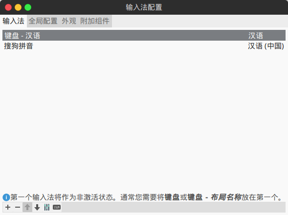
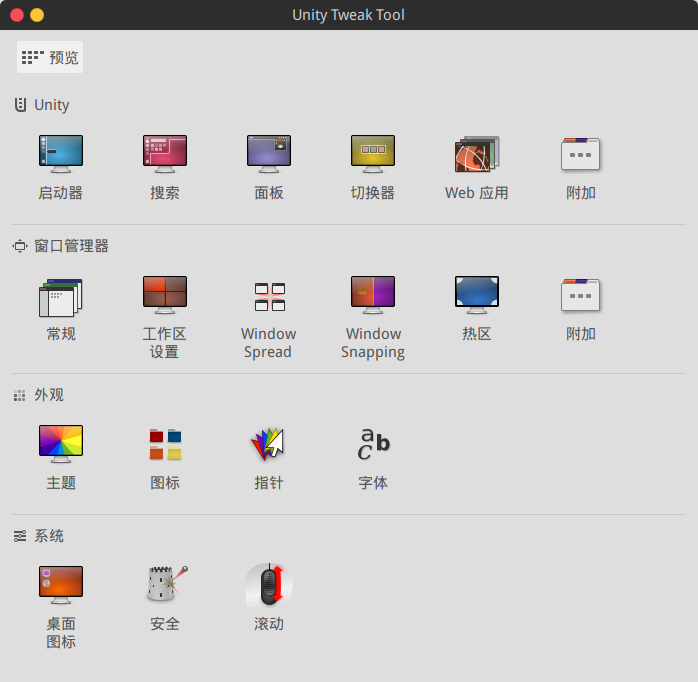
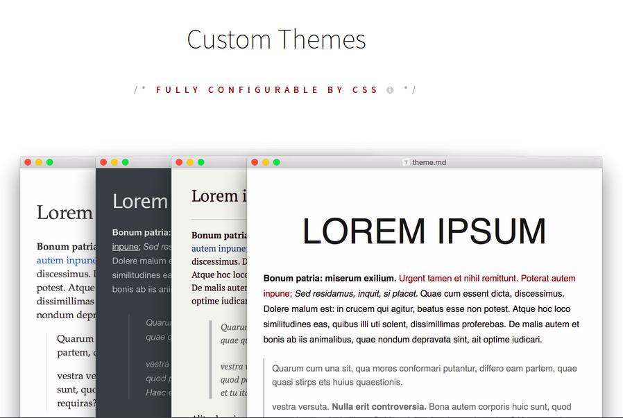

# Ubuntu


> 注：这篇文章是对在前文的一次修订，采用 visual studio code 编写。涵盖从 Ubuntu .

## **1.系统更新**

当安装 Ubuntu 系统进入桌面后，可以选择**重启一次**，然后执行以下操作。

* **命令行更新**

```shell
sudo apt-get update
sudo apt-get upgrade
```

* **系统设置 -> 系统 -> 详细信息**

    在右下角处有一个检查**系统更新**的按钮


* **系统设置 -> 语言支持**

    点开后会让你下载完整的语言列表。
---

## **2.安装搜狗输入法**

Ubuntu 使用到的 deb 安装包请点击[搜狗输入法官网](http://pinyin.sogou.com/linux/?r=pinyin)下载。

关于安装，deb 的安装包确实可以通过双击自动安装，但是如果现依赖问题时，通过这种安装方式是得不到错误提示的，所以在这里我强烈推荐在 shell 里安装 deb 包。安装命令为： `sudo dpkg -i sougou.deb`

在 shell 里如果安装出错无外乎**依赖未能解决**，可以通过命令： `sudo apt-get -f install` 解决依赖问题，然后重复上面的 deb 安装即可。

在实际的使用中，需要对系统做一些配置，否则容易会出现一些问题（比如已经键入的字符点击shift时不能提交）

* **系统设置 -> 文本输入**

    将输入源修改成只有**搜狗拼音**（*如果点加号后找不到搜狗可以注销/重启一次*）


* **修改fcitx配置**

    在已安装的软件列表中找到 **Fcitx 配置**，将输入法更改成：第一个为键盘-汉语，第二个为搜狗拼音。



---

## **3.系统美化**

**尊重原作，尊重原作。** 主要的原则参考了 *Zee 张程*的 [ubuntu16.04 主题美化和软件推荐](http://blog.csdn.net/terence1212/article/details/52270210)这篇博客，*顺便再修改一下的。*

**3.1 系统更新** :

这个我前面提到了，不多说了。

**3.2 载 libreOffice、删除 Amazon 的链接、删除不常用的软件**:

3.2.1. libreOffice 必须卸载，一点也不好用，我们可以使用 WPS 替换；

3.2.2 Amazon 链接这个，等会儿要安装 *unity-tweak-tool* ，它与 Amazon 似乎有什么依赖上的联系，所以如果在删除掉这个链接后，在 shell 里执行 `sudo apt-get upgrade` 会有一个提示让你 autoremove 一下，作为强迫症执行后，你就发现 **unity-tweak-tool 连着被卸载了**。而在如果重装 unity-tweak-tool 还会把 Amazon 给装出来，真是日了狗了的感觉。所以自己抉择吧。

3.2.3 删除不常用软件这个，我没用。我还是比较喜欢*自己判断*（虽然主要原因是看不懂它在卸载什么 GG.. )。

**3.修改 hosts 篇**:

    # 没 host，上 shadowsocks！！！
    
    sudo add-apt-repository ppa:hzwhuang/ss-qt5
    sudo apt-get update
    sudo apt-get install shadowsocks-qt5

**4.主题美化篇 unity-tweak-tool、Flatabulous 主题、oh-my-zsh 终端、字体**:

对于 unity 桌面来说 unity-tweak-tool 简直神器，这个软件我在别的博客里见的不止一次，不知道他们的截图为什么都是统一的英文版，但是他是有中文的！*其功能强大，可做修改的地方极多，自行尝试咯。*



4.1 Flatabulous 主题，几乎所有说到主题美化的帖子都会提及它吧，博主的代码建议**按照顺序进行。**

4.2 oh-my-zsh 终端漂不漂亮显示一说，但是它的 Tab 补全功能简直是完美。在它的 Github :[robbyrussell/oh-my-zsh](https://github.com/robbyrussell/oh-my-zsh) 说的很详细。

它的前置需求是：**1.curl or wget should be installed. 2.git should be installed**

所以自然的我们要安装 git，curl 和 wget 我推荐 *wegt* 的方式。

    sudo apt-get install git
    sudo apt-get install zsh
    wget https://github.com/robbyrussell/oh-my-zsh/raw/master/tools/install.sh -O - | sh
    chsh -s /usr/bin/zsh

PS：oh-my-zsh 的更新命令是：`upgrade_oh_my_zsh`

4.3 字体

不得不说文泉译微米黑字特别适合 Linux，同时它还有等宽的字体。

    sudo apt-get install fonts-wqy-microhei

5.**至于其他的我就不说了，毕竟这个分类是美化**

---

## **4.配置 JDK 环境变量**

linux 上的 jdk 分 OracleJDK 和 OpenJDK 两种。可以都安装，通过控制台命令切换。

**4.1安装 openjdk**:

    终端输入`sudo apt-get install openjdk-8-jdk`

**4.2 安装 Oraclejdk**:

首先在 [Oracle 官网](http://www.oracle.com/technetwork/java/javase/downloads/jdk8-downloads-2133151.html)下载 Linux 版本的 jdk 安装包。需要注意的是我们要手动配置 jdk 的环境变量，这点和 Windows 上是一样的道理，此外 jdk 的解压位置我选择在：`/usr/lib/jvm/jdk1.8`，此处安装位置可以自行选择，把文件解压到这里是需要root权限的，**我们通过 `sudo nautilus` 命令打开一个 root 权限的文件管理器。**

**4.3 配置环境变量**:

linux 的环境变量写法(适用于多个目录)：export PATH=$PATH:目录一:目录二:目录三

    sudo gedit /etc/profile
    
    # 打开文本编辑器后，在最下面添加：
    
    export JAVA_HOME=/usr/lib/jvm/jdk1.8
    
    export JRE_HOME=${JAVA_HOME}/jre
    
    export CLASSPATH=.:${JAVA_HOME}/lib:{JRE_HOME}/lib
    
    export PATH=$PATH:{JAVA_HOME}/bin:
    
    //JAVA_HOME的值根据你的解压目录自行写入，然后保存退出
    
    source /etc/profile
    
    # 在 shell 里输入此使环境变量生效（注销用户也是可以的）

接下来给刚刚配置好的 JDK 添加软链接：

    ```shell
    sudo update-alternatives --install /usr/bin/java java /usr/lib/jvm/jdk1.8/bin/java 300
    
    sudo update-alternatives --install /usr/bin/javac javac /usr/lib/jvm/jdk1.8/bin/javac 300
    
    sudo update-alternatives --install /usr/bin/jar jar /usr/lib/jvm/jdk1.8/bin/jar 300
    ```
它告诉系统这个路径存在这个JDk外，还提供了优先级。软链接是可以删除的，怎么删除百度吧。不过这个时候就算shell里输入 `java -version` 也是没有的，可以通过 `sudo update-alternatives --config xxx` 手动选择，或者重启/注销一次。

---

## **5.解决 Ubuntu/Windows 双系统重启后时间不匹配**

    windows 是把 BIOS 的时间当做默认时间
    ubuntu 是把 BIOS 当做 GTM+0,我国在东八区，所以为 GTM+8;

解决方法也是一行代码 `timedatectl set-local-rtc 1`

```shell
//查看当前时间管理状态：
timedatectl
//运行该命令：
timedatectl set-local-rtc 1
//再次查看时间管理状态：
timedatectl
```

参考博客: [ubuntu,windows双系统时间不统一](http://www.jianshu.com/p/1fd8cb0683a0)

---

## **6.安装 QQ 轻聊版7.9**

我是在 [Ubuntu 16 安装 qq 教程](http://blog.csdn.net/lj402159806/article/details/53783516?locationNum=7&fps=1)这篇博客找到的，利用了 deepin 的 crossover 和 QQ 包，安装过程请查阅原博客。此外说一句正版的 crossover 售价 145 人民币。

在安装上 crossover 后，打开拖动 QQ 轻聊版的图标就可以拖出一个 QQ 的桌面图标，修改一下 icon 数据添上图标，然后把它**锁定到启动器**，以后就可以快速启动了。


---

## **安装软件**

WPS、网易云音乐、Atom 之类的都有 deb 包，用 `sudo dpkg -i xxx.deb` 安装就好了，出了问题就去解决依赖。

像 IDEA、pycharm、webstorm 提供的是 .tar.gz，解压后往 bin 目录找 xxxx.sh 文件执行 `./xxxx.sh` 也就可以了，唯一要注意的是别画蛇添足的 `sudo ./xxxx.sh` ,用 root 权限装后期也很麻烦。

---

### 此外 markdown 软件我推荐 Typora，这个感觉对 markdown 更友好，我使用 vscode 纯粹是习惯而已哈哈。

```shell
# optional, but recommended

sudo apt-key adv --keyserver keyserver.ubuntu.com --recv-keys BA300B7755AFCFAE

# add Typora's repository

sudo add-apt-repository 'deb http://typora.io linux/'

sudo apt-get update

# install typora

sudo apt-get install typora
```

