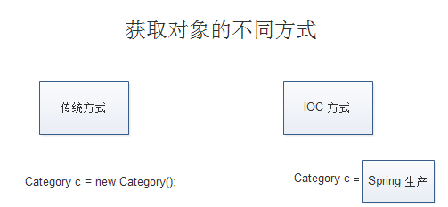

# Spring 框架（一）IOC 控制反转

## 一、 概念

**IOC**(*Inversion of Control*)：

那么控制反转是什么意思呢：**对象的创建交给外部容器完成，这个就做控制反转。**

- **Spring 使用控制反转来实现对象不用在程序中写死**
- **控制反转解决对象处理问题【把对象交给别人创建】**

那么对象的对象之间的依赖关系 Spring 是怎么做的呢：**依赖注入，dependency injection.**

- **Spring 使用依赖注入来实现对象之间的依赖关系**
- **在创建完对象之后，对象的关系处理就是依赖注入**

简单说就是创建对象由以前的程序员自己 new 构造方法来调用，变成了交由 Spring 创建对象  DI 依赖注入

Dependency Inject. 简单地说就是拿到的对象的属性，已经被注入好相关值了，直接使用即可。  

以获取对象的方式来进行比较

**传统的方式**： 

通过 new 关键字主动创建一个对象

**IOC方式**：

对象的生命周期由 Spring 来管理，直接从 Spring 那里去获取一个对象。 IOC 是控制反转 (Inversion Of Control)的缩写，就像控制权从本来在自己手里，交给了 Spring。 

打个比喻：

* **传统方式**：相当于你自己去菜市场 new 了一只鸡，不过是生鸡，要自己拔毛，去内脏，再上花椒，酱油，烤制，经过各种工序之后，才可以食用。
* **IOC**：相当于去馆子 (Spring) 点了一只鸡，交到你手上的时候，已经五味俱全，你就只管吃就行了。

  

> IOC 的思想最核心的地方在于，资源不由使用资源的双方管理，而由不使用资源的第三方管理，这可以带来很多好处。**第一，资源集中管理，实现资源的可配置和易管理**。**第二，降低了使用资源双方的依赖程度，也就是我们说的耦合度**。
>
> 也就是说，甲方要达成某种目的不需要直接依赖乙方，它只需要达到的目的告诉第三方机构就可以了，比如甲方需要一双袜子，而乙方它卖一双袜子，它要把袜子卖出去，并不需要自己去直接找到一个卖家来完成袜子的卖出。它也只需要找第三方，告诉别人我要卖一双袜子。这下好了，甲乙双方进行交易活动，都不需要自己直接去找卖家，相当于程序内部开放接口，卖家由第三方作为参数传入。甲乙互相不依赖，而且只有在进行交易活动的时候，甲才和乙产生联系。反之亦然。这样做什么好处么呢，甲乙可以在对方不真实存在的情况下独立存在，而且保证不交易时候无联系，想交易的时候可以很容易的产生联系。甲乙交易活动不需要双方见面，避免了双方的互不信任造成交易失败的问题。**因为交易由第三方来负责联系，而且甲乙都认为第三方可靠。那么交易就能很可靠很灵活的产生和进行了**。这就是 IOC 的核心思想。生活中这种例子比比皆是，支付宝在整个淘宝体系里就是庞大的 IOC 容器，交易双方之外的第三方，提供可靠性可依赖可灵活变更交易方的资源管理中心。另外人事代理也是，雇佣机构和个人之外的第三方。
>
> 在以上的描述中，诞生了两个专业词汇，依赖注入和控制反转所谓的依赖注入，则是，甲方开放接口，在它需要的时候，能够讲乙方传递进来(注入)所谓的控制反转，甲乙双方不相互依赖，交易活动的进行不依赖于甲乙任何一方，整个活动的进行由第三方负责管理。

